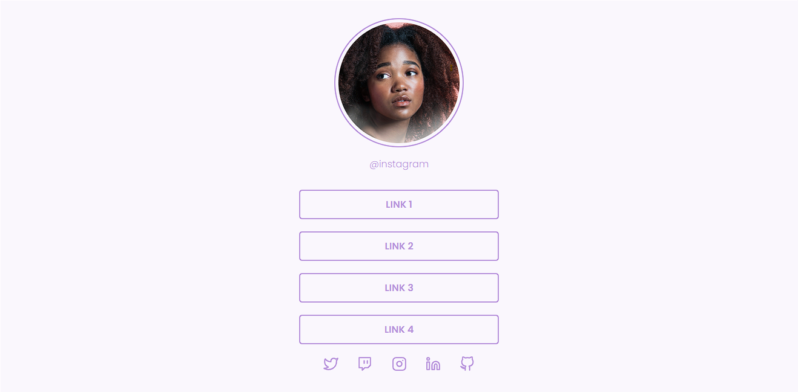

Projeto criado com o obetivo de consolidar e aprimorar os aprendizados de HTML e CSS obtidos no curso 'Discover', concluindo o desafio "Social Tree" da Rocketseat.

Foi meu primeiro projeto web Front-end criado sozinho, utilizando como base um layout disponibilizado no Figma pela Rocketseat.

Demonstração da página concluída (ainda sem responsividade):

Link do layout utilizado: https://www.figma.com/community/file/1241119965004546666/Social-Tree-%E2%80%A2-Desafio-Discover